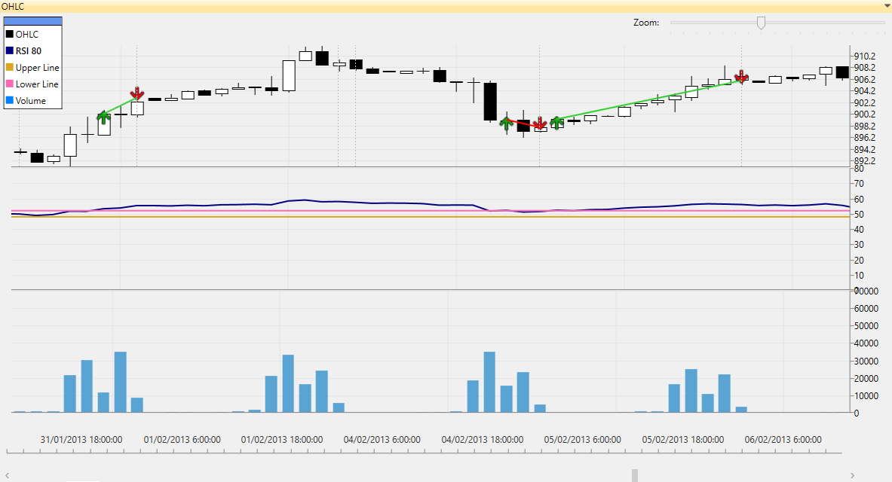
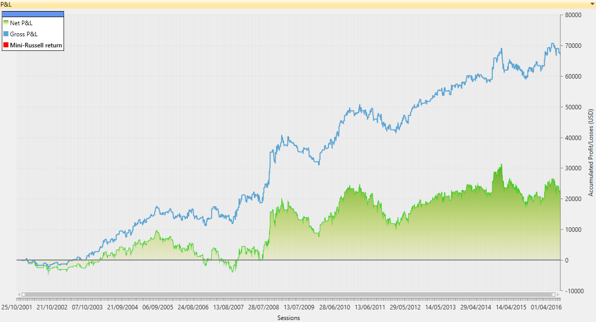

Daenerys Trading Strategy
============================================

Table of Contents
----

* [Overview](#overview)
* [Daenerys Trading Rules](#daenerys-trading-rules)
* [Download](#download)
* [Quick Start](#quick-start)
* [User Manual](#user-manual)
* [About iSystems](#about-isystems)
* [Disclaimer](#disclaimer)

Overview
----

Daenerys is a trading algorithm written in VB.Net using the [TradingMotion SDK] development tools (there is a [C# port] too).


<sub>__Image footnote:__ Example of Daenerys OHLC financial chart showing some automatic trades</sub>

The strategy code is all contained in [DaenerysStrategy.cs], including a default parameter combination.

This default parameter combination has been optimized to run over 120' bars of _Mini-Russell Future Index_.

Trading a maximum of 1 contract of TFS Future, this is how performed (hypothetically) from 2001 to 20014:


<sub>__Image footnote:__ Hypothetic Net P&L chart for Daenerys strategy</sub>

Anyway, go open Visual Studio, clone the project and start with the trading algo development! Sure you can do better and improve all these figures :)

Daenerys Trading Rules
----

Daenerys' trading plan is quite simple. When flat, it __buys 1 contract__ when the price breaks above a specified RSI's level, or __sells 1 contract__ when the price breaks belowe another RSI's level.

While the strategy has a position in the market, it __places a Stop Loss__ order (accept we were wrong on our prediction and cut the losses). Besides, if a reversal signal is triggered (the contrary RSI signal entry level is broken) it closes the current position.

Besides, this is a pure __intraday strategy__. That means it won't leave any open position at the end of the session, so in case we still got a position it will be closed automatically.

### To sum up ###
```
DaenerysStrategy rules:

  * Entry: Price breaks above RSI buy level (long entry) or price breaks below RSI sell level (short entry)
  * Exit: Set a fixed Stop Loss and closes the position on a reversal signal
  * Filters (sets the entry only under certain conditions): None
```

### Show me the code ###

Here is a simplified C# source code of Daenerys' _OnNewBar()_ function. The complete code is all contained in [DaenerysStrategy.cs] along with comments and definition of parameters.

```VB.net
Dim stopMargin As Double = Me.GetInputParameter("Catastrophic Stop Loss ticks distance") * Me.GetMainChart().Symbol.TickSize

Dim buySignal As Integer = Me.GetInputParameter("RSI Buy signal trigger level")
Dim sellSignal As Integer = Me.GetInputParameter("RSI Sell signal trigger level")

If rsiIndicator.GetRSI()(1) <= buySignal And rsiIndicator.GetRSI()(0) > buySignal And Me.GetOpenPosition() <> 1 Then

    If Me.GetOpenPosition() = 0 Then

        ' BUY SIGNAL: Entering long and placing a catastrophic stop loss
        Dim buyOrder As MarketOrder = New MarketOrder(OrderSide.Buy, 1, "Enter long position")
        catastrophicStop = New StopOrder(OrderSide.Sell, 1, Me.Bars.Close(0) - stopMargin, "Catastrophic stop long exit")

        Me.InsertOrder(buyOrder)
        Me.InsertOrder(catastrophicStop)

    ElseIf Me.GetOpenPosition() = -1 Then

        ' BUY SIGNAL: Closing short position and cancelling the catastrophic stop loss order
        Dim exitShortOrder As MarketOrder = New MarketOrder(OrderSide.Buy, 1, "Exit short position (reversal exit signal)")

        Me.InsertOrder(exitShortOrder)
        Me.CancelOrder(catastrophicStop)

    End If

ElseIf rsiIndicator.GetRSI()(1) >= sellSignal And rsiIndicator.GetRSI()(0) < sellSignal And Me.GetOpenPosition() <> -1 Then

    If Me.GetOpenPosition() = 0 Then

        ' SELL SIGNAL: Entering short and placing a catastrophic stop loss
        Dim sellOrder As MarketOrder = New MarketOrder(OrderSide.Sell, 1, "Enter short position")
        catastrophicStop = New StopOrder(OrderSide.Buy, 1, Me.Bars.Close(0) + stopMargin, "Catastrophic stop short exit")

        Me.InsertOrder(sellOrder)
        Me.InsertOrder(catastrophicStop)

    ElseIf Me.GetOpenPosition() = -1 Then

        ' SELL SIGNAL: Closing long position and cancelling the catastrophic stop loss order
        Dim exitLongOrder As MarketOrder = New MarketOrder(OrderSide.Sell, 1, "Exit long position (reversal exit signal)")

        Me.InsertOrder(exitLongOrder)
        Me.CancelOrder(catastrophicStop)

    End If

End If
```

Download
----

First of all, make sure you have Visual Studio 2010 version (or higher). [TradingMotion SDK] is fully compatible with [Visual Studio Express] free versions.

Download TradingMotion [Visual Studio extension], and the windows desktop application [TradingMotionSDK Toolkit installer].


Quick Start
----

* Create a free account to access TradingMotionAPI (required). It can be created from TradingMotionSDK Toolkit (the desktop application)
* Clone the repository:
```sh
git clone https://github.com/victormartingarcia/daenerys-trading-strategy-csharp
```
* Open Visual Studio and load solution _DaenerysStrategy/DaenerysStrategy.sln_
* Edit _app.config_ file adding your TradingMotionAPI credentials on _appSettings_ section

And you're all set!

Running the project (F5) will perform a _development backtest simulation_ over last 6 months DAX 60' bars data.

Once it has finished, it will ask if you want to see the P&L report in TradingMotionSDK Toolkit. Pressing 'y' will load the same backtest with the desktop app, where it will show performance statistics, charts, and so on.

User Manual
----

__[More documentation in the Getting Started Guide]__

About iSystems
----

[iSystems] by [TradingMotion] is a marketplace for automated trading systems.

_iSystems_ has partnered with [11 international brokers](http://www.tradingmotion.com/Brokers) (and counting) that offer these trading systems to their clients (both corporate and retail) who pay for a license fee that the developer charges.

The trading systems run with live market data under a controlled environment in iSystems' datacenters.

This way the developers just need to worry about how to make their trading systems better and iSystems platform does the rest.

Visit [Developers] section on TradingMotion's website for more info on how to develop and offer your systems.

Disclaimer
----

I am R&D engineer at [TradingMotion LLC], and head of [TradingMotion SDK] platform. Beware, the info here can be a little biased ;)

  [C# port]: https://github.com/victormartingarcia/daenerys-trading-strategy-csharp
  [TradingMotion SDK]: http://sdk.tradingmotion.com
  [DaenerysStrategy.cs]: DaenerysStrategy/DaenerysStrategy.cs
  [iSystems platform]: https://www.isystems.com
  [iSystems.com]: https://www.isystems.com
  [iSystems]: https://www.isystems.com
  [TradingMotion LLC]: http://www.tradingmotion.com
  [TradingMotion]: http://www.tradingmotion.com
  [Developers]: http://www.tradingmotion.com/Strategies/Developers
  [Visual Studio Express]: http://www.visualstudio.com/en-us/downloads#d-2010-express
  [TradingMotion SDK website]: http://sdk.tradingmotion.com
  [TradingMotionSDK Toolkit installer]: http://sdk.tradingmotion.com/files/TradingMotionSDKInstaller.msi
  [Visual Studio extension]: http://sdk.tradingmotion.com/files/TradingMotionSDK_VisualStudio.vsix
  [More documentation in the Getting Started Guide]: http://sdk.tradingmotion.com/GettingStarted
